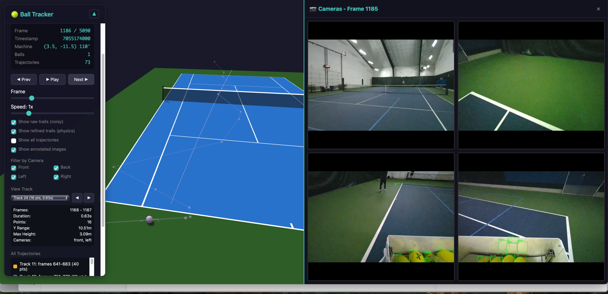
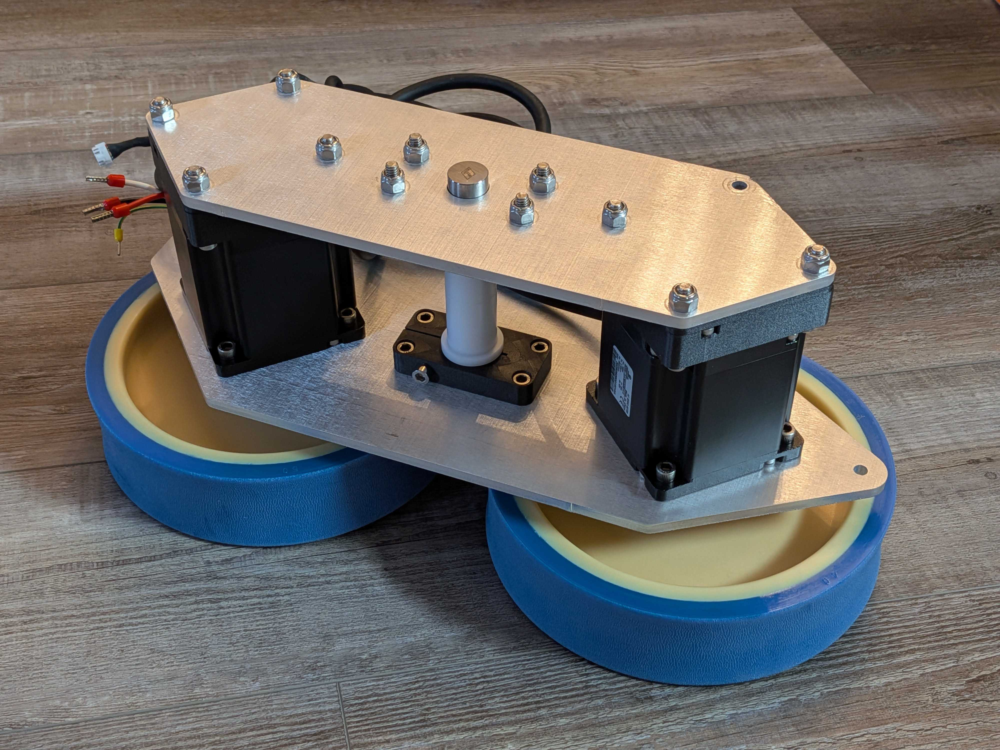
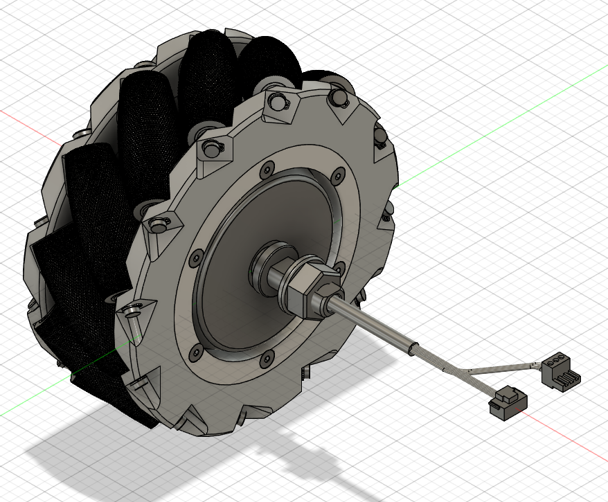
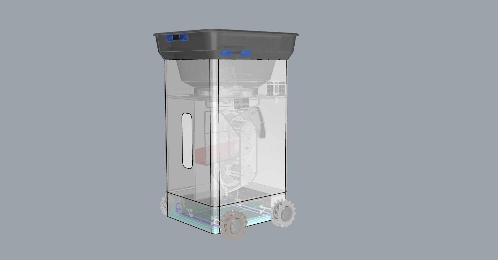

# Tensa

[](https://github.com/notnil/tensa/actions/workflows/ci.yml)

[](assets/hero/tensa-hero-movement.mp4)

Tensa is an autonomous tennis robot that moves around the court on its own using a mecanum drive base, localizes itself against tennis-court geometry, tracks balls and players with ZED stereo cameras, and drives a programmable throw system for repeatable shots from a compact mobile platform.

This repo is a curated engineering snapshot of the AI, robot-control, firmware, and hardware work.

## What It Does

Tensa combines perception, localization, motion, and ball delivery into one court-aware robot:

- Sees the court through multiple ZED stereo cameras.
- Estimates robot pose in a tennis-court coordinate frame.
- Detects tennis balls in stereo image pairs, triangulates 3D position, and tracks flight paths through bounces.
- Tracks players and court context for drill logic and targeting.
- Moves holonomically with a mecanum drive base.
- Controls a dual-wheel thrower, angle axis, dispenser, and load sensor through ClearCore firmware.

## System Overview

```text
ZED cameras + court geometry
        |
        v
Perception and localization
        |
        v
Robot runtime and drill logic
        |
        v
Mecanum drive + ClearCore thrower firmware
```

The code is useful for understanding the architecture and implementation direction. Reproducing the full robot requires hardware, model weights, calibration data, and ZED recordings that are intentionally not included.

## Highlights

- Real-time stereo ball tracking from ZED cameras using a custom 2D-to-3D triangulation path instead of noisy SDK depth-map lookups.
- YOLO/SAM-assisted tennis ball detection, with TensorRT export support for Jetson-class inference.
- Multi-camera court localization and robot pose estimation from known court geometry.
- Physics-aware ball trajectory tracking with Kalman filtering, gravity, bounces, and offline/online refinement.
- Go robot-control stack for mecanum drive, thrower control, BLE/gamepad control, ZED camera capture, NATS-style pub/sub, and drill logic.
- ClearCore firmware for the throw system: top/bottom wheel motors, angle control, dispenser, load sensor, TCP command server, and fault handling.
- Hardware exploration around mecanum drive modules, compact throw assemblies, Jetson/ZED camera packaging, composite chassis, and serviceable electronics.

## Repository Map

| Path | What is there |
|------|---------------|
| `ai/` | Python ball tracking, localization, and training/evaluation code. |
| `robot/` | Go runtime for hardware control, drill logic, telemetry, camera interfaces, and court geometry helpers. |
| `firmware/` | ClearCore firmware and motor parameter/configuration snapshots for the throw system. |
| `hardware/` | Hardware notes and visual references for the mobile robot, drive base, thrower, and camera packaging. |
| `docs/` | Architecture, robot runtime, ball-tracking, localization, and hardware methodology notes. |
| `assets/` | Selected AI, localization, and hardware visuals. |

## Suggested Reading Path

1. Start with the [documentation index](docs/README.md) and [Architecture notes](docs/architecture.md) for the system split.
2. Read [Ball tracking methodology](docs/ai/ball-tracking-methodology.md) for stereo geometry and the physics tracker.
3. Read [Localization methodology](docs/ai/localization-methodology.md) for court-frame pose estimation.
4. Read [Robot runtime](docs/robot-runtime.md) for the Go control loop and hardware abstractions.
5. Browse [Firmware](firmware/README.md) and [Hardware notes](docs/hardware.md) for the thrower, drive base, and packaging work.

## AI System

The perception work evolved toward a four-camera ZED setup. The most successful ball-tracking path used independent left/right 2D detections, epipolar matching, direct stereo triangulation, and then transformation into court coordinates. Localization projected camera observations onto a court model so the robot could estimate its X/Y position and heading before moving or aiming.

The major lesson was that SDK depth maps worked well for surfaces and people but were unreliable for tennis balls: the ball is small, textureless, fast, and often blurred. Direct stereo geometry produced much more stable depth and cleaner bounce locations.




[YOLO ball detector demo video](assets/ai/yolo-ball-detection-demo.mp4)

More detail:

- [AI overview](ai/README.md)
- [Training code notes](ai/training/README.md)
- [Ball tracking methodology](docs/ai/ball-tracking-methodology.md)
- [Localization methodology](docs/ai/localization-methodology.md)
- [Architecture notes](docs/architecture.md)

## Hardware and Firmware

Tensa's hardware direction combined a Jetson compute stack, ZED cameras, a ClearCore throw controller, mecanum drive modules, a compact dual-wheel throw system, and a composite shell/chassis concept.







[Throw system consistency test video](assets/hardware/throw-system-test.mp4)

More detail:

- [Firmware overview](firmware/README.md)
- [Hardware notes](docs/hardware.md)
- [Thrower protocol](robot/pkg/hware/thrower/protocol.md)

## Running Checks

The default checks are designed to run on a normal development machine without robot hardware:

```bash
make test-go
make test-python
```

The Go code builds without ZED hardware by using stub implementations. ZED support requires the Stereolabs SDK and the `zed_sdk` build tag.

GitHub Actions runs the same checks on `main` and pull requests.

Hardware/native checks are opt-in:

```bash
make test-go-native   # includes native packages such as ZED/ONNX runtime
make test-go-hardware # includes CAN, BLE, speaker, and robot bench tests
```

## Included and Omitted Assets

Included:

- Core Go robot-control code.
- Python ball-tracking, localization, and training/evaluation scaffolding.
- ClearCore thrower firmware and motor configuration snapshots.
- Representative AI, localization, hardware, and firmware visuals.

Not included:

- Raw datasets, SVO recordings, training runs, and cloud buckets.
- Large model checkpoints, TensorRT engines, and private calibration datasets.
- Private deployment details, machine-specific setup, and internal service wiring.

## License

MIT. See [LICENSE](LICENSE).
