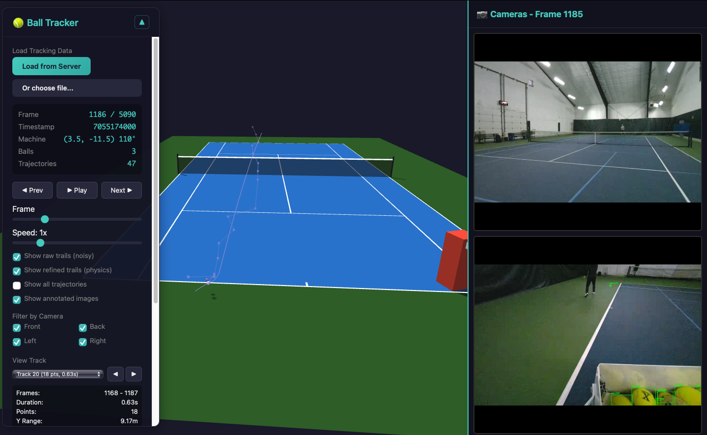
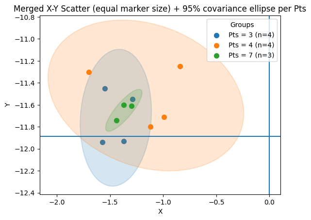

# Tensa

[](https://github.com/notnil/tensa/actions/workflows/ci.yml)

Tensa was an autonomous tennis ball machine startup project: a mobile robot that could localize itself on court, track balls and players, move with mecanum wheels, and throw repeatable shots from a compact hardware platform.

The company stopped before launch, but this repo preserves the engineering work as a portfolio artifact. It is intentionally curated from several private repos. Old experiments, private deployment scripts, network credentials, large model weights, raw datasets, generated vendor trees, and machine-specific setup files were removed.

## Status

This is an archived portfolio snapshot, not an actively maintained product. The code is useful for understanding the architecture and implementation direction, but reproducing the full robot requires hardware, model weights, calibration data, and ZED recordings that are intentionally not included.



## Highlights

- Real-time-ish stereo ball tracking from ZED cameras using a custom 2D-to-3D triangulation path instead of noisy SDK depth-map lookups.
- YOLO/SAM-assisted tennis ball detection, with TensorRT export support for Jetson-class inference.
- Multi-camera court localization and robot pose estimation from known court geometry.
- Physics-aware ball trajectory tracking with Kalman filtering, gravity, bounces, and offline/online refinement.
- Go robot-control stack for mecanum drive, thrower control, BLE/gamepad control, ZED camera capture, NATS-style pub/sub, and drill logic.
- ClearCore firmware for the throw system: top/bottom wheel motors, angle control, dispenser, load sensor, TCP command server, and fault handling.
- Hardware exploration around mecanum drive modules, compact throw assemblies, Jetson/ZED camera packaging, composite chassis, and serviceable electronics.

## Repository Map

```text
.
├── ai/             # Ball tracking, localization, and training code
├── assets/         # Selected AI and hardware visuals from project Slack
├── firmware/       # ClearCore throw-system firmware and motor configs
├── hardware/       # Hardware notes and visual references
├── robot/          # Go robot-control stack
└── docs/           # Architecture and project notes
```

## AI System

The perception work evolved toward a four-camera ZED setup. The most successful ball-tracking path used independent left/right 2D detections, epipolar matching, direct stereo triangulation, and then transformation into court coordinates.

The major lesson was that SDK depth maps worked well for surfaces and people but were unreliable for tennis balls: the ball is small, textureless, fast, and often blurred. Direct stereo geometry produced much more stable depth and cleaner bounce locations.




[YOLO ball detector demo video](assets/ai/yolo-ball-detection-demo.mp4)

More detail:

- [AI overview](ai/README.md)
- [Ball tracking methodology](docs/ai/ball-tracking-methodology.md)
- [Localization methodology](docs/ai/localization-methodology.md)
- [Architecture notes](docs/architecture.md)

## Hardware and Firmware

Tensa's hardware direction combined a Jetson compute stack, ZED cameras, a ClearCore throw controller, mecanum drive modules, a compact dual-wheel throw system, and a composite shell/chassis concept.


[Throw system consistency test video](assets/hardware/throw-system-test.mp4)

More detail:

- [Firmware overview](firmware/README.md)
- [Hardware notes](docs/hardware.md)
- [Thrower protocol](robot/pkg/hware/thrower/protocol.md)

## Running Checks

```bash
make test-go
make test-python
```

The Go code builds without ZED hardware by using stub implementations. ZED support requires the Stereolabs SDK and the `zed_sdk` build tag.

GitHub Actions runs the same checks on `main` and pull requests.

## What Is Not Included

- Private datasets, GCS buckets, SVO recordings, and training runs.
- Large model checkpoints and TensorRT engines.
- Private Slack links, customer/team contact details, and deployment credentials.
- Historical branches and one-off experiments that did not represent the final direction.

## License

MIT. See [LICENSE](LICENSE).
