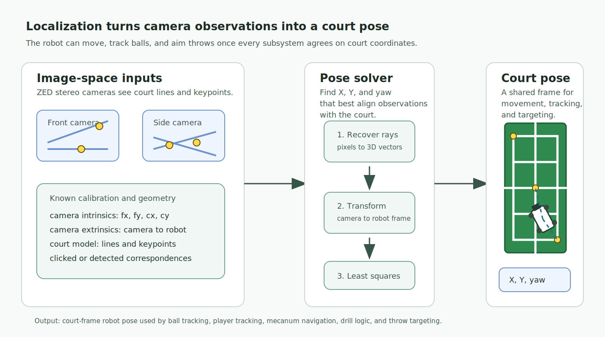
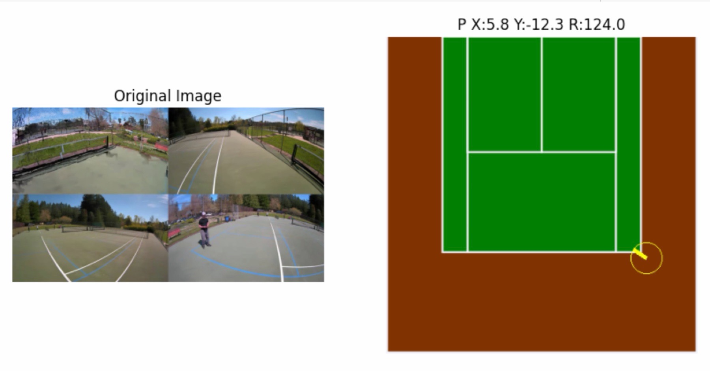
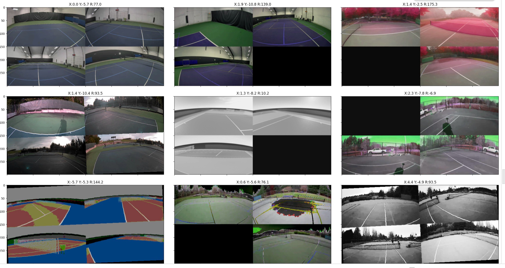

# Machine Localization Methodology

This document describes the approach for determining machine position on a tennis court using stereo depth and known court geometry.

## Goal

The localization system turns camera observations into a court pose: machine X,
machine Y, and machine yaw. That pose lets the robot share one coordinate frame
across ball tracking, player tracking, movement, and throw targeting.



## 1. Machine Localization

The localization system determines the machine's position (X, Y) and orientation (Yaw) in the court coordinate system.



### Coordinate Systems

Three coordinate frames are involved:

1.  **Camera Frame**: Origin at the left lens. X-right, Y-down, Z-forward (standard image coordinates).
2.  **Machine Frame**: Origin at machine center. X-right, Y-forward, Z-up.
3.  **Court Frame**: Origin at net center. X-across court, Y-along court (toward far baseline), Z-up.

### Camera Extrinsics

Each camera has known extrinsics relative to the machine center:
*   **Translation** `[X, Y, Z]`: Position of the left lens in machine coordinates (meters).
*   **Rotation**: Facing direction and pitch angle, encoded as a 3x3 rotation matrix that maps from camera frame to machine frame.

#### Extrinsics Profiles

**`camera_stand`** — Cameras mounted on a stand (machine height: 1.2954m)

| Camera | Translation (X, Y, Z) | Facing | Pitch |
|--------|----------------------|--------|-------|
| front  | (-0.060, 0.114, 0.036) | +Y | 0° |
| back   | (0.060, -0.116, 0.025) | -Y | 40° down |
| left   | (-0.116, -0.060, 0.025) | -X | 40° down |
| right  | (0.116, 0.060, 0.025) | +X | 40° down |

**`body_cam`** — Cameras mounted on machine body (machine height: 1.124m)

| Camera | Translation (X, Y, Z) | Facing | Pitch |
|--------|----------------------|--------|-------|
| front  | (-0.060, 0.273, 1.124) | +Y | 25° down |
| back   | (0.060, -0.273, 1.124) | -Y | 40° down |
| left   | (-0.248, -0.060, 1.124) | -X | 40° down |
| right  | (0.248, 0.060, 1.124) | +X | 40° down |

**`body_cam_v2_front_5deg`** — Same as `body_cam` but with front camera pitched only 5° down.

### Camera Intrinsics

Intrinsic parameters describe the internal geometry of each camera and are required for stereo triangulation:

| Parameter | Description |
|-----------|-------------|
| `fx`, `fy` | Focal length in pixels (horizontal and vertical) |
| `cx`, `cy` | Principal point / optical center in pixels |
| `baseline` | Distance between left and right lenses (meters) |

#### Obtaining Intrinsics

For ZED cameras, intrinsics are retrieved from the camera's factory calibration:

```python
cam_info = zed.get_camera_information()
calib = cam_info.camera_configuration.calibration_parameters

fx = calib.left_cam.fx
fy = calib.left_cam.fy
cx = calib.left_cam.cx
cy = calib.left_cam.cy
baseline = calib.get_camera_baseline()
```

These values are typically exported to a `calibration.json` file during data export so that subsequent processing does not require the ZED SDK.

#### Stereo Triangulation

Given a point visible in both left and right images at pixel coordinates `(u_left, v)` and `(u_right, v)`:

```
disparity = u_left - u_right
Z = (fx * baseline) / disparity
X = (u_left - cx) * Z / fx
Y = (v - cy) * Z / fy
```

This produces the 3D position `[X, Y, Z]` in camera frame coordinates.

### N-Point Pose Solver

Given N≥2 correspondences between clicked image points and known court keypoints:

1.  **3D Ray Retrieval**: For each clicked pixel, retrieve the 3D vector from the point cloud (camera frame).
2.  **Machine Frame Transform**: Apply the camera's extrinsics to get the vector in machine frame.
3.  **Least-Squares Optimization**: Solve for the optimal yaw angle and X/Y translation that minimizes the error between:
    *   The transformed machine-frame vectors projected into court space
    *   The known court keypoint positions

The solver reduces localization to a small optimization problem: find the court
position and yaw that best align observed camera rays with known court geometry.

### Model-Based Localizer

The project also explored learned localization from camera images. One
development snapshot for a short-height camera configuration reported roughly
0.20m mean 2D position error and roughly 2.3 degrees mean rotation error on a
small evaluation set before later simulated and labeled-data retraining. Those
numbers are best read as a development checkpoint, not a final benchmark, but
they were good enough to guide the rest of the runtime design: localization
needed to be expressed in meters and degrees with explicit uncertainty, not just
as a visual overlay.

### Constraints for Robustness

To handle noisy depth data:

1.  **Fixed Height**: The machine center height is locked to a known value (measured manually). This removes one degree of freedom.
2.  **Upright Assumption**: The machine is assumed level with the court (no roll or pitch). This reduces the problem to solving only for yaw and X/Y position.

## 2. Evaluation Views

The localization tooling rendered multi-camera snapshots alongside the solved court pose so failures could be reviewed visually. The montage below shows examples across indoor, outdoor, RGB, infrared, and segmentation-style views, with the estimated pose printed above each panel as X/Y court position and rotation.



## 3. Labeling Workflow

The labeling process uses a visual interface for high-accuracy ground truth generation:

1.  **Keypoint Selection**: The user selects a known court keypoint (e.g., net center, baseline corner).
2.  **Pixel Click**: The user clicks the corresponding location in one of the camera images.
3.  **3D Lookup**: The system retrieves the 3D coordinates from the pre-computed point cloud.
4.  **Pose Computation**: After two or more correspondences, the solver computes machine pose.
5.  **Verification**: A verification error (RMSE of point reprojection) is displayed to validate label quality.

## 4. Output Data Format

Labels are stored with the following fields per frame:

| Field | Description |
|-------|-------------|
| `frame_idx` | Sequential frame index |
| `timestamp_ns` | Nanosecond timestamp |
| `points` | List of correspondences (camera, keypoint ID, 3D vector) |
| `machine_x` | Machine X position in court coordinates (meters) |
| `machine_y` | Machine Y position in court coordinates (meters) |
| `machine_z` | Machine Z position / height (meters) |
| `machine_yaw` | Machine orientation (degrees, 0=+X, 90=+Y) |

This labeled dataset can be used for training or validating machine localization algorithms.
