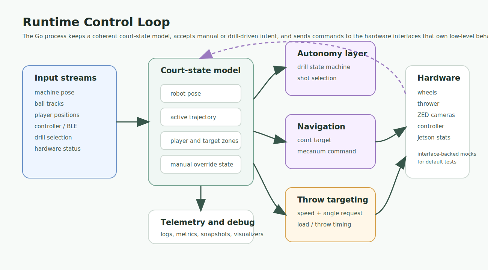

# Robot Runtime

The Go runtime is the integration layer between court-space perception and robot hardware. It receives camera, localization, player, ball, controller, and drill state; turns that state into movement or throw decisions; and talks to hardware through small interfaces that can be replaced with mocks in tests.

## Runtime Shape



The runtime does not try to own every robotics concern directly. Its job is to keep the current court state coherent, decide what the robot should do next, and route commands to the subsystem that owns the low-level details.

## Important Packages

| Package | Role |
|---------|------|
| `cmd/tensactl` | Main robot control process. |
| `pkg/ai/location` | Runtime-facing machine location stream. |
| `pkg/ai/player` | Player detection/localization interface and mocks. |
| `pkg/ai/navigation` | Navigation helpers that convert court targets into movement requests. |
| `pkg/tennis/court2d` and `pkg/tennis/court3d` | Court dimensions, directions, geometry helpers, and coordinate utilities. |
| `pkg/hware/wheels` | Mecanum and wheel-control abstractions. |
| `pkg/hware/thrower` | Thrower client, mock, audio wrapper, and line-oriented command protocol. |
| `pkg/hware/zed` | ZED camera wrapper and portable stubs. |
| `pkg/hware/controller` | BLE/gamepad control surfaces for manual operation and drill control. |
| `pkg/pubsubx` | Lightweight in-process stream plumbing. |
| `pkg/metrics` | Runtime metrics helpers. |

## State Model

The central runtime assumption is that high-level state should be court-aware:

- Machine pose is represented as court X/Y position plus orientation.
- Player and ball locations are converted out of image coordinates before they reach drill logic.
- Navigation targets are expressed in court units.
- Throw requests can be described in terms of shot intent while the thrower firmware owns motor-level details.

That split keeps the system debuggable. A bad shot can be traced to localization, targeting, thrower calibration, or low-level motor behavior instead of being hidden inside one large control path.

## Hardware Boundary

The runtime talks to hardware through interfaces rather than raw device calls:

- Wheels receive drive/velocity-style commands and report wheel status.
- The ClearCore thrower receives commands for wheel RPM, angle, dispenser motion, and load sensing.
- ZED cameras are wrapped so builds can use either SDK-backed implementations or portable stubs.
- Controller input is translated into robot-level commands instead of being coupled to individual motors.

This is why the public checks can run on a normal development machine. Hardware-specific behavior is still present, but the default test path exercises the portable interface and logic layers.

## Control Loop Responsibilities

At runtime, the control process coordinates:

1. Camera and perception stream startup.
2. Machine pose updates.
3. Controller/manual override handling.
4. Drill selection and drill state transitions.
5. Navigation requests for mecanum movement.
6. Thrower command dispatch and status reads.
7. Debug snapshots, logs, metrics, and telemetry streams.

## Testing Strategy

The repository keeps the default Go tests hardware-free:

```bash
make test-go
```

That path builds portable packages and runs mocks/stubs where the original robot required ZED SDK libraries, BLE adapters, CAN hardware, speakers, or the physical thrower.

Hardware-oriented targets are opt-in:

```bash
make test-go-native
make test-go-hardware
```

Use those on a configured robot or bench setup when validating real camera, GPU, controller, wheel, and thrower behavior.
