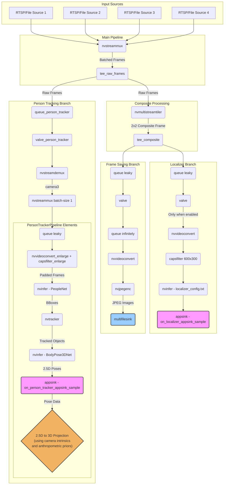

# Camera Array Spec V4


**Camera Positions (1 \= rear camera and increasing going CCW)**

The cameras are mounted on the Robot in the following way. Rotation units are in degrees.

| Camera | FOV (deg) | Rotation (X plane) | Rotation (Y plane) | Relative X (mm) | Relative Y (mm) | Relative Z (mm) |
| :---- | :---- | :---- | :---- | :---- | :---- | :---- |
| 1 | 120 | 0 | \-20 | 0 | \-122.060 | 23.631 |
| 2 | 120 | 60 | \-20 | 105.707 | 61.030 | 23.631 |
| 3 | 55 | 180 | \-7 | 0 | 118.751 | 26.607 |
| 4 | 120 | \-60 | \-20 | \-105.707 | 61.030 | 23.631 |

So, in words: camera 3 is pointing directly forward. Camera 1 is pointing backward. Camera 2 is angled toward the robot's front-right quadrant, while camera 4 is angled toward the front-left. Cameras 2 and 4 are positioned closer to camera 3 than they are to camera 1.

All cameras are pointed slightly downward (Y-plane rotation).

\*\*The camera height is 63in (\~1600mm) from the ground to the bottom of the camera plate  
\*\*\*The camera lens height is roughly 63.93in (\~1624mm) for the rear camera


# DeepStream Multi-Pipeline Streaming Inference

This DeepStream application runs multiple concurrent inference pipelines:
- **Localizer Pipeline**: Custom localizer model for position and rotation estimation
- **Person Tracking Pipeline**: Person detection, tracking, and 3D pose estimation
- **Recording Pipeline**: Frame saving to JPEG files

To run the entire pipeline in its default production configuration, making sure to embed the latest code into the container image, run:
```sh
docker compose up --build
```

**Make sure to start the inference arms!** See NATS Control chapter.

## Development Mode

For development, a separate Docker Compose file `dev.yml` is provided. This file inherits from `docker-compose.yml` and includes development-specific configurations such as verbose logging and mounting the code directory for live changes. 

**Note** that the pipeline reads from mp4 files instead of RTSP streams in development mode!

To run the pipeline in development mode:
```sh
docker compose -f dev.yml up --build
```

## Environment Variables

The following environment variables can be set:

- `NATS_URL`: NATS server URL
- `CAMERA_NATIVE_WIDTH`: Camera resolution width. Must correspond to actual camera resolution.
- `CAMERA_NATIVE_HEIGHT`: Camera resolution height. Must correspond to actual camera resolution.
- `MP4_TEST_MODE`: (optional) When set to `True` (or any non-empty string), the pipeline will use local MP4 files (`/work/testdata/cam{1,2,3,4}.mp4`) as input sources instead of live RTSP camera feeds. This mode is intended for testing and development, and it uses buffer presentation timestamps (PTS) instead of Network Time Protocol (NTP) timestamps, which is appropriate for file-based playback.

## Pipeline Architecture

The pipeline reads from 4 RTSP cameras simultaneously and processes frames through multiple branches:

1. **Localizer Branch**: Runs custom localizer model inference
2. **Person Tracking Branch**: Detects persons, tracks them, and estimates 3D poses (currently only the camera3 feed is processed to avoid redundant inference)
3. **Recording Branch**: Saves composite frames as JPEG files

All branches can be independently controlled via NATS commands.



## Compiling new localizer model weights

1. Convert the new version of the model weights to `localizer.onnx` and save it at `models/localizer/localizer.onnx`, overwriting the current version.
2. Delete the existing `.engine` file from the `models/localizer/` directory.
3. Run `docker compose -f dev.yml up --build`. This will mount the `deepstream` code directory and start the pipeline.
4. On pipeline startup, DeepStream will find the `localizer.onnx` but it will notice that the `.engine` file is missing. It will automatically create a new `.engine` file from the `.onnx` file. This process takes ~1 min and does not print to stdout. You can tell it is running by looking at the GPU use in `jtop`. You should see a new `.engine` file appear in the `models/localizer` directory once it is done. Leave both the `onnx-file` and `model-engine-file` entries in `configs/localizer_config.txt`; DeepStream handles regeneration automatically.
5. Commit the newly created `.engine` file and `localizer.onnx` file to git lfs.

## Message Structures

### Localizer Messages

Timestamps are in Unix ns. Messages are published to `LOCALIZER` at the full inference rate, so about 50-60 FPS.

```json
{
  "x": -0.3652293086051941,
  "y": -10.291752815246582,
  "rotation": 1.7394750118255615,
  "frame_timestamps": {
    "0": 1744973369150948000,
    "1": 1744973369151098000,
    "2": 1744973369151240000,
    "3": 1744973369151514000
  },
  "send_time": 1744973369185204497
}
```

**A note on Localizer Pose Conventions:**

The localizer branch in `main.py` publishes the robot pose in the court/world frame:

- `x` / `y` (meters) use the same robot-centric axes (right/forward) but expressed in absolute court coordinates.
- `rotation` (radians) is the robot yaw measured in the court plane with `0` pointing along the positive court **X** axis (court width) and increasing counter-clockwise.

When transforming robot-relative data to the court frame, apply the yaw as described above so that a robot pointing straight down-court (toward positive court **Y**) corresponds to `rotation = π/2`.

### Person Tracking Messages

Messages are published to `PERSON_TRACKER` containing detected persons with 3D pose data. Timestamps are in Unix ns.

```json
{
  "frame_timestamps": {
    "0": 1744973369150948000,
    "1": 1744973369151098000,
    "2": 1744973369151240000,
    "3": 1744973369151514000
  },
  "send_time": 1744973369185204497,
  "detections": [
    {
      "camera_id": "camera3",
      "pad_index": 2,
      "object_id": 0,
      "pose_2d": [
        [300.69, 286.91],
        ... (34 keypoints, each [x, y])
      ],
      "pose_3d": [
        [-9780.77, -3285.54, 10947.93],
        ... (34 keypoints, each [x, y, z] in millimeters)
        ... these coordinates are already in the robot-centric frame,
        ... with the robot's center as origin (see coordinate system below).
      ],
      "confidence": [
        0.838, 0.782, ... (34 confidence values)
      ]
    }
  ]
}
```

The `pose_2d` and `pose_3d` arrays contain 34 keypoints. The order of keypoints is as follows:
- 0: pelvis, 1: left_hip, 2: right_hip, 3: torso
- 4: left_knee, 5: right_knee, 6: neck
- 7: left_ankle, 8: right_ankle
- 9-14: foot keypoints (toes, heels)
- 15: nose, 16-19: eyes and ears
- 20-21: shoulders, 22-25: arms and wrists
- 26-33: hand keypoints

**Coordinate System:**
- **2D poses** (`pose_2d`): Pixel coordinates in the camera's image plane, with padding adjustment applied (coordinates are relative to the padded frame, with `PAD_DIM=128` pixels subtracted).
- **3D poses** (`pose_3d`): Coordinates in millimeters **relative to the robot's position**. The origin is at the robot's center, with:
  - X-axis pointing right from the robot's perspective
  - Y-axis pointing forward from the robot's perspective
  - Z-axis pointing up from the robot's perspective

The 3D coordinates are automatically transformed from each camera's local coordinate frame to the robot's coordinate frame using the camera mounting parameters (position offset, yaw rotation, and pitch angle) defined in `CAMERA_INTRINSICS` in `intrinsics.py`. This transformation accounts for each camera's:
- **mount_offset_mm**: 3D position offset of the camera relative to the robot center
- **yaw_offset**: Horizontal rotation angle of the camera (in radians)
- **pitch_deg**: Vertical tilt angle of the camera (in degrees, negative values indicate downward tilt)

## Pipeline Control via NATS

The pipeline can be controlled dynamically using NATS request-reply messages sent to the control topic `DS_CONTROL`.

You can use the `nats` CLI tool to send these commands.

**Get Status:**

Check the current status of all pipeline branches.

```sh
nats req DS_CONTROL get_status
```
*Example Response:* 
```json
{
  "status": "ok", 
  "message": "Current status retrieved.", 
  "data": {
    "is_recording": true, 
    "is_localizer": true,
    "is_person_tracking": false
  }
}
```

**Stop Commands:**

Stop specific branches or multiple branches.

```sh
# Stop only recording
nats req DS_CONTROL 'stop recording'

# Stop only localizer branch
nats req DS_CONTROL 'stop localizer'

# Stop only person tracking
nats req DS_CONTROL 'stop person_tracking'

# Stop multiple branches
nats req DS_CONTROL 'stop recording person_tracking'

# Stop all branches
nats req DS_CONTROL stop
```

**Start Commands:**

Start specific branches or multiple branches.

```sh
# Start only recording (creates new timestamped directory)
nats req DS_CONTROL 'start recording'

# Start only localizer branch
nats req DS_CONTROL 'start localizer'

# Start only person tracking
nats req DS_CONTROL 'start person_tracking'

# Start multiple branches
nats req DS_CONTROL 'start localizer person_tracking'

# Start all branches
nats req DS_CONTROL start
```

*Example Response:* `{"status": "ok", "message": "start scheduled for recording, start scheduled for person_tracking."}`

### Pipeline Startup State

Branch enablement now resets to the built-in defaults whenever the container starts. Recording is disabled on boot, while the localizer and person tracking branches start enabled. Send NATS control commands after restarts if you need a different combination. Note that the inference arms cannot be in a disabled state during pipeline start, because they will subsequently ignore `start` commands for unknown reasons.

## Camera Configuration

### Camera Setup
The pipeline is configured for 4 RTSP cameras with hardcoded URLs:
- Camera 1: `rtsp://192.168.1.101:5005/routecam`
- Camera 2: `rtsp://192.168.1.102:5005/routecam`
- Camera 3: `rtsp://192.168.1.103:5005/routecam`
- Camera 4: `rtsp://192.168.1.104:5005/routecam`

### Camera Intrinsics
The person tracking pipeline uses fisheye camera calibration for accurate 3D pose reconstruction. Camera intrinsic parameters (camera matrix and distortion coefficients) are loaded from `calibration_result.json` via the `intrinsics.py` module, which provides the `CAMERA_INTRINSICS` dictionary used throughout the pipeline.

These calibration matrices are essential for converting 2.5D pose estimates to accurate 3D coordinates. The calibration assumes 1920x1080 resolution and will be automatically scaled if a different resolution is used (maintaining the same aspect ratio).

### Find the camera IPs

Camera IPs are currently hardcoded. If you have reason to believe the IPs are different than the ones currently hardcoded, you can find them on the network by scanning IP ranges using `nmap`. For example:

```sh
nmap -sn 192.168.1.0/24
```

## Person Tracking Models

The person tracking pipeline uses three AI models:

1. **PeopleNet** (`resnet34_peoplenet_int8.onnx`): Person detection
2. **NvDCF Tracker**: Multi-object tracking
3. **BodyPose3DNet** (`bodypose3dnet_accuracy.onnx`): 3D pose estimation with 34 keypoints

Models and configurations are located in the `models/` directory.

## Output Data

### Frame Recording
When recording is enabled, composite frames from all 4 cameras are saved as JPEG files in timestamped directories under `/app/output/frames/YYYYMMDD-HHMMSS/`. When running in Docker, make sure to mount this directory to the host filesystem for persistence.

### Real-time Inference
Both localizer and person tracking results are published to their respective NATS topics in real-time, allowing for immediate processing by downstream applications.

## NATS Logger Script

A Python script `nats_logger.py` is provided to read messages from the `LOCALIZER` and `PERSON_TRACKER` NATS topics and append them to separate JSONL files.

To use the logger script:
1. Ensure you have `uv` installed on your system.
2. Set the `NATS_URL` environment variable to point to your NATS server:
   ```sh
   export NATS_URL="nats://localhost:4222"
   ```
   (Adjust the URL if your NATS server is running on a different address or port.)
3. Run the script using `uv`:
   ```sh
   uv run nats_logger.py
   ```
   This command will automatically handle the `nats-py` dependency.

The script will create two JSONL files in the same directory:
- `localizer.jsonl`: Contains messages from the localizer pipeline.
- `person_tracker.jsonl`: Contains messages from the person tracking pipeline.

Messages will be appended to these files as they are received. The script is designed to fail hard on any connection or message parsing errors.

## Visualization Script

The `visualize.py` script is used to visualize the outputs of the person tracker and localizer pipelines on video files. It combines feeds from multiple cameras into a single output video, overlays 2D pose keypoints, and displays the robot's dynamic location on a minimap.

To use the visualization script:

1.  **Generate Data**: Ensure you have `person_tracker.jsonl` and `localizer.jsonl` files generated by `nats_logger.py` from your DeepStream pipeline run. These files should be in the same directory where you run the visualization script.

2.  **Prepare Video Files**: Have your `cam1.mp4`, `cam2.mp4`, `cam3.mp4`, and `cam4.mp4` video files available. These correspond to the camera feeds from which the data was generated.

3.  **Run the Script**: Execute the script with the required arguments:

```sh
uv run visualize.py \
  --videos testdata/cam1.mp4 testdata/cam2.mp4 testdata/cam3.mp4 testdata/cam4.mp4 \
  --person-tracker person_tracker.jsonl \
  --localizer localizer.jsonl \
  --output combined_visualization.mp4 \
  --confidence-threshold 0.0
```

**Arguments:**
-   `--videos CAM1 CAM2 CAM3 CAM4`: (Required) Paths to the four input MP4 video files, in order (cam1.mp4, cam2.mp4, cam3.mp4, cam4.mp4).
-   `--person-tracker FILE`: (Required) Path to the `person_tracker.jsonl` file containing person tracking data.
-   `--localizer FILE`: (Required) Path to the `localizer.jsonl` file containing localizer data.
-   `--output FILE`: (Required) Path for the output annotated video file (e.g., `combined_visualization.mp4`).
-   `--confidence-threshold FLOAT`: (Optional) Minimum confidence threshold for displaying keypoints (default: 0.0).
-   `--disable-minimap`: (Optional) Disable bird's eye minimap overlay.
-   `--minimap-size WIDTH HEIGHT`: (Optional) Minimap size in pixels (default: 300 300).

**Important Notes:**
- The robot pose is automatically determined from the `localizer.jsonl` data. No manual camera position configuration is required.
- When no localizer data is available for a frame, the robot will not be rendered on the minimap.
- Person poses are transformed to world coordinates using the robot pose from localizer data. If no localizer data is available, poses cannot be reliably projected to world space and will not be rendered on the minimap.
- The script uses absolute world coordinates for the tennis court layout, making the visualization independent of any fixed camera position assumptions.

The script will generate a single output MP4 video file with a 2x2 grid layout, showing each camera feed with overlaid person tracking data and a dynamic minimap displaying the robot's position and detected persons (when localizer data is available).
